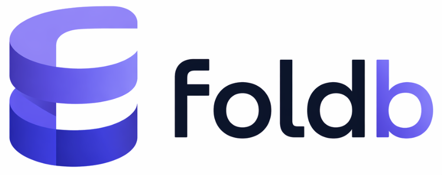

# foldb



A replicated, deterministic state machine key-value store written in Zig. The log is the source of truth; state is `fold(log)` — a pure function cached in an LSM tree. One global sequence number, no wall clocks inside the fold.

> **Status**: single-node is stable. Multi-node replication (Raft transport) is in active development.

## Requirements

[Zig](https://ziglang.org/) 0.16.0

## Building

```bash
zig build                              # build
zig build test                         # unit + integration tests
```

## Running

```bash
foldb serve --config config.json
```

### Interactive REPL

```bash
foldb repl --host 127.0.0.1 --port 7432
```

Supports commands: `set <key> <value>`, `get <key>`, `delete <key>`, `range <start> <end>`, `batch <file.json>`, and `exit`.

### Full-featured Client

```bash
foldb client --host 127.0.0.1 --port 7432 --command get --key "mykey"
foldb client --host 127.0.0.1 --port 7432 --command set --key "mykey" --value "myvalue"
```

## Configuration

```jsonc
{
  "storage_dir": "/var/lib/foldb",   // required — where data is stored
  "node_id": 1,                      // unique integer per node in the cluster
  "listen_addr": "0.0.0.0",          // optional, default: 0.0.0.0
  "listen_port": 7432,               // optional, default: 7432
  "peers": [],                       // optional — list of peer objects
  "max_epoch_size": 10000,           // optional — max transactions per Raft epoch
  "election_timeout_min_ms": 150,    // optional — Raft election timeout range
  "election_timeout_max_ms": 300,
  "heartbeat_interval_ms": 50        // optional — Raft heartbeat interval
}
```

## Architecture

- **Wire Protocol** — Custom binary protocol (frames, streams, typed messages) over TCP.
- **Gateway** — Validates requests, submits mutations through the Sequencer, serves reads from Storage.
- **Sequencer** — Global ordering via Raft consensus. Assigns monotonically increasing sequence numbers.
- **Executor** — Folds committed log entries into Storage deterministically.
- **Storage** — LSM tree (L0-L2 local, L3 optional object store). Opaque byte values.
- **CDC** — Change Data Capture streams before/after images of mutations.

## Docs

- [`docs/internal/`](docs/internal/) — subsystem reference (storage, log, gateway, sequencer, CDC, network)

## License

Copyright © Jeremy Tregunna. Released under the [Apache 2.0 License](LICENSE).
